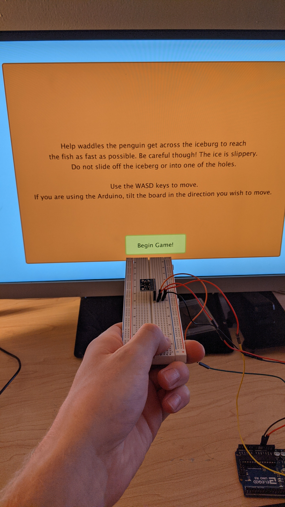

# Final-Project-NMD211
## 1.
Below is a picture of all the wiring involved for the GY-521 Module. The vcc gets 5V power, the gnd is connected to ground, the SCL on the GY-521 connects to the SCL on the Arduino, likewise the SDA is connected on both boards.

When using the “controller”, the side of the GY-521 board with the pins needs to point to the right side of the monitor. The VCC pin on the GY-521 needs to be closer to the user and away from the monitor. This gives us the proper orientation and will make the penguin move in the direction desired. A picture of this is below.

## 2.
The game code already has the Arduino implementation code in it. There are two lines of code that need to be uncommented however. Instructions are in the comments of the game as well as a video explanation [HERE](https://photos.app.goo.gl/5CRFzZJayp9J78Ez9). At the beginning of the game there is a window that explains the basics of the game contoles. I did not go into extensive detail on how exact movements or key presses affect the character. This was intinchanal. The game is meant as a speedrun type of game. Part of the fun and strategy is learning how the controls affect the charter for the fastest run times.

## 3.
As far as the code is concerned, I think I made the Arduino connection as smooth as possible. The Arduino only sends data when the game asks for it. The game only reads from the Serial port when it sees the newline character (\n). The data from the Arduino is sent across as one string with only the needed information plus a tab character (\t) to separate the data making it easier for the game to distinguish between the two data values sent.

The controller itself has nothing fancy to it. It is simply just sitting in a breadboard with the wires coming off the side. If I were to make a fancy housing for the board, I would probably make a rectangle roughly the same size as the iceberg in the game. The wires would also come out the back of the housing so that they are out of the way as much as possible. In a supper fancy world I would have the housing completely wireless using bluetooth to send the data. This would allow for complete freedom from wires getting in the way.

## 4.

## Extra
The game will remember the level data from the last time it was played. If the level data is wished to be reset, you can delete the “level.txt” file in the data folder in the Processing folder. You would then copy the “ORIGINAL levels.txt” file and rename it to “level.txt” keeping it in the data folder. A video explanation can be found [HERE](https://photos.app.goo.gl/BPZNymWb6knzZGEN8).

If you wish to replace the layout of the levels you can uncomment the parts in the program that say they were used for level design. You would then start the game and simply click where you would like a hole in the level. In the Processing console there will be a list of coordinates. Copy the list minus the number of waste clicks times 2.(this will make more sense in the video.) Paste the list in the “level.txt” file under the level you wish to change. The number of holes is also needed to be added in the text file. A video explanation can be found [HERE](https://photos.app.goo.gl/36QMxY1PowGykNkLA).
