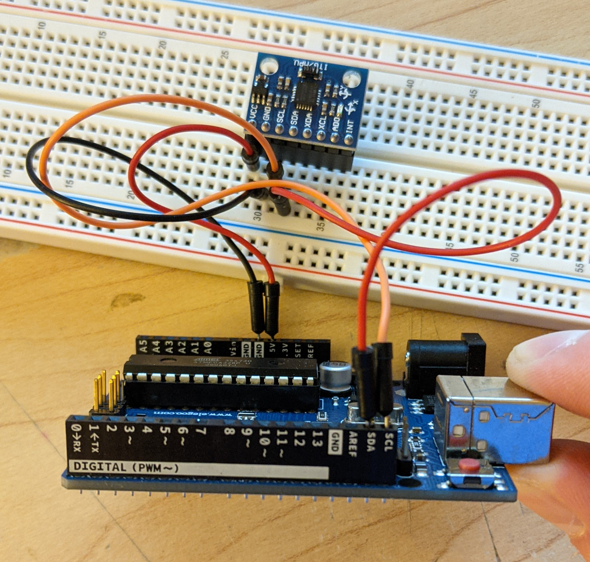

# Final-Project-NMD211

Below is a picture of all the wiring involved for the GY-521 Module. The vcc gets 5V power, the gnd is connected to ground, the SCL on the GY-521 connects to the SCL on the Arduino, likewise the SDA is connected on both boards.

